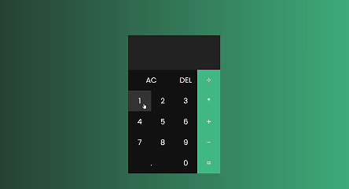

# Projeto Calculadora — calculadora simples com UI responsiva

## TL;DR

Aplicação de calculadora web com operações básicas (soma, subtração, multiplicação, divisão). Projeto pensado para demonstrar lógica, manipulação do DOM, atenção a UX e boas práticas front-end.

## Features

- Operações básicas: +, -, ×, ÷
- Interface clicável
- Layout responsivo (mobile + desktop)
- Tratamento básico de edge-cases (ex.: impedir múltiplos pontos decimais)

## Tech Stack

- Front-end: HTML, CSS, JavaScript
- Deploy: GitHub Pages

Objetivo deste repositório: demonstrar fundamentos e ser um case apresentável no portfólio.

### Contato

Email: <leonardopinheirosilva16@gmail.com>

LinkedIn: <https://www.linkedin.com/in/leonardo-pinheiro-13ba26281/>

---

Clique [aqui](https://leopinheirosilva.github.io/projeto-calculadora/) para acessar o site!
